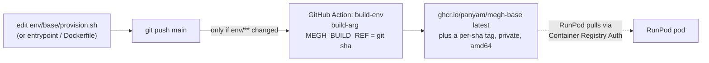
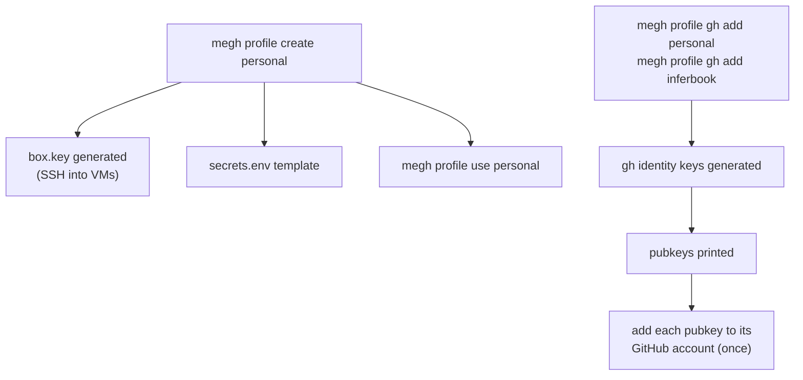
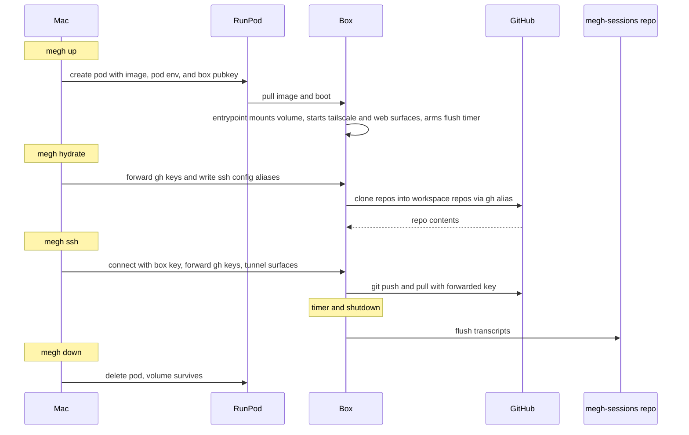
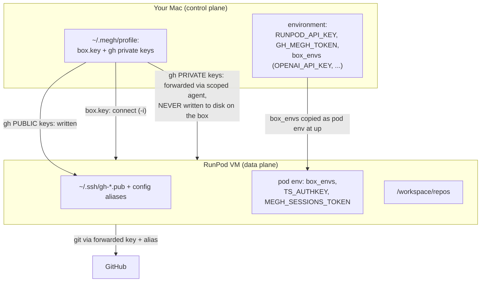
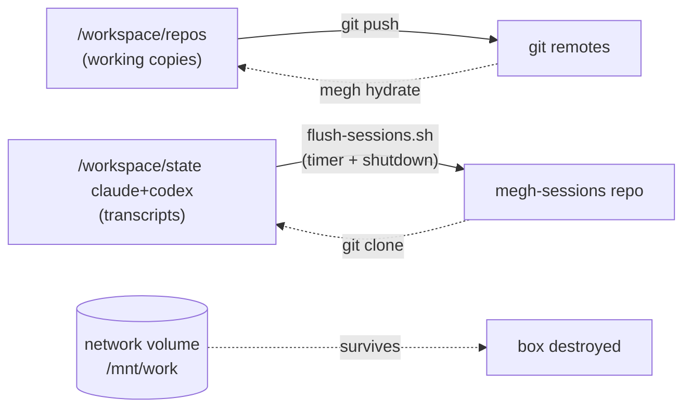

# megh lifecycle

The flows that make up a megh box, from image build to teardown, and exactly
where keys and secrets live. See `DESIGN.md` for rationale and `WORKFLOW.md` for
the operational runbook.

## 1. Image build and publish (config-as-code)

The dev environment is declared once and built by CI. Nothing is ever installed
by hand on a box and snapshotted.



CLI-only changes (`cmd/`, `internal/`) do **not** trigger a build; they run on
your Mac, not in the image.

## 2. Profile setup (once per machine / identity)



## 3. Box lifecycle: up -> hydrate -> work -> down



Repos are **not** cloned automatically by `megh up`; `megh hydrate` does it (it
needs your forwarded keys, which only exist during a client-driven SSH).

## Access surfaces (all private)

Every surface is bound to localhost (reached via an SSH tunnel or Tailscale) or
is key-auth only. Nothing but SSH is ever on the public proxy, and only when
`expose_ssh: true`.

| Surface | Port | Reach it via |
|---|---|---|
| SSH (shell, git, tunnels) | 22/tcp | `megh ssh`: public ip:port (key auth), or the tailnet (Tailscale SSH) |
| ttyd web shell (tmux) | 7681 | tunnel → `localhost:7681`, or `http://<box>:7681` on the tailnet |
| noVNC headed browser | 6080 | tunnel → `localhost:6080/vnc.html`, or `http://<box>:6080/vnc.html` |
| code-server (VS Code) | 8080 | tunnel → `localhost:8080`, or `http://<box>:8080` on the tailnet; Remote-SSH also works |

`megh ssh` forwards 7681/6080/8080 to your localhost automatically. With
Tailscale up, the same surfaces are served by name over the tailnet (phone /
tablet friendly). `expose_ssh: false` drops even public 22/tcp; the RunPod
console Web Terminal stays the break-glass.

## 4. Where keys and secrets live

The important one. Private SSH keys never land on a box; secrets only land on a
box if you explicitly declare them as `box_envs`.



| Thing | On the box? | How |
|---|---|---|
| Box SSH key (private) | no | on your Mac; used to connect |
| GitHub SSH keys (private) | **no** | forwarded via scoped ssh-agent |
| GitHub SSH keys (public) | yes | written to `~/.ssh/gh-*.pub` + config aliases |
| `RUNPOD_API_KEY`, `GH_MEGH_TOKEN` | no | used by megh on the Mac |
| Service API keys (`box_envs`) | yes | copied into pod env at `megh up` |
| `TS_AUTHKEY`, `MEGH_SESSIONS_TOKEN` | yes | pod env (tailscale / session flush) |

## 5. State and persistence



The volume is fast scratch, not the source of truth: code lives in git, agent
history in the sessions repo, and both rehydrate onto a fresh volume.

## Verifying the running image

Each image is stamped at build with the git SHA it came from. From a box:

```
cat /etc/megh/build-info
# ref=<git-sha>
# built=<timestamp>
```

Compare `ref` to the `latest` SHA tag from `megh registry ls`. If they match,
the box is running the current image. (Requires the build stamp, which lands in
the next image build after this change.)
```
